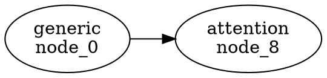

# 🏛️ K'UHUL Kernel v1.0 - Final Specification

```
Version: 1.0.0
Date: 2026-07-15
Status: RELEASED
Philosophy: The runtime exists before AI. Everything else is installed.
```

---

## 🎯 The Critical Insight

> **Can the runtime exist before AI?**
> 
> **Answer: YES**

The kernel answers only four questions:

```
1. What Fold is active?
2. Which Nodes belong to that Fold?
3. How is the Graph transformed?
4. Which Fold is legal next?
```

**Everything else becomes optional.**

---

## 🏛️ Complete Architecture

```
┌─────────────────────────────────────────────────────────────────────────┐
│  K'UHUL Kernel v1.0 (Domain-Agnostic)                                   │
│                                                                         │
│  • Folds    → Semantic state containers (Pop, Wo, Sek, Chen, Xul)       │
│  • Nodes    → Active transformations (load, parse, plan, allocate...)   │
│  • XCFE     → Transition engine (Pop → Wo → Sek → Chen → Xul → Pop)    │
│  • Graphs   → Data structure flowing through folds                      │
│                                                                         │
│  DOES NOT KNOW: AI, Physics, SVG, Databases, SCXQ2, JSON, DOT, LLVM    │
└─────────────────────────────────────────────────────────────────────────┘
                                    ↓
┌─────────────────────────────────────────────────────────────────────────┐
│  Graph IR (Serialization Layer)                                         │
│                                                                         │
│  • Structured representation of kernel graphs                           │
│  • Adds types, attributes, metadata                                     │
│  • Kernel-independent serialization                                     │
└─────────────────────────────────────────────────────────────────────────┘
                                    ↓
┌─────────────────────────────────────────────────────────────────────────┐
│  Serializers (Multiple Output Formats)                                  │
│                                                                         │
│  • SCXQ2 → Backend compilation (WGSL, HLSL, OpenCL)                     │
│  • JSON  → Interchange, debugging                                       │
│  • DOT   → Visualization (Graphviz)                                     │
│  • LLVM  → Further compilation                                          │
│  • ...   → Add new formats without changing kernel                      │
└─────────────────────────────────────────────────────────────────────────┘
                                    ↓
┌─────────────────────────────────────────────────────────────────────────┐
│  Plugins (Domain-Specific Capabilities)                                 │
│                                                                         │
│  • TransformerPlugin → Q/K/V, attention, softmax, residual, layer norm  │
│  • LoRAPlugin        → Low-rank adaptation matrices                     │
│  • MoEPlugin         → Router, expert routing, combining                │
│  • PhysicsPlugin     → Bodies, fields, forces, collisions               │
│  • SVGPlugin         → Paths, shapes, rendering                         │
│  • DatabasePlugin    → Queries, indexes, transactions                   │
│  • ...               → Add new capabilities without changing kernel     │
└─────────────────────────────────────────────────────────────────────────┘
```

---

## 📐 Formal Definition

### **The Kernel Contract**

```typescript
interface Kernel {
  // 1. What Fold is active?
  getCurrentFold(): string;
  
  // 2. Which Nodes belong to that Fold?
  getNodes(foldName: string): Node[];
  
  // 3. How is the Graph transformed?
  processFold(foldName: string, graph: Graph): Graph;
  
  // 4. Which Fold is legal next?
  transitionTo(nextFold: string): void;
}
```

### **Graph IR Layer**

```typescript
interface GraphIRModule {
  name: string;
  version: string;
  nodes: GraphIRNode[];
  edges: GraphIREdge[];
  metadata: Map<string, any>;
}

interface GraphIRSerializer {
  name: string;
  serialize(module: GraphIRModule): string;
}

// Serializers: SCXQ2, JSON, DOT, LLVM, ...
```

### **Plugin System**

```typescript
interface KernelPlugin {
  name: string;
  nodes: Map<string, Node[]>;  // fold name → nodes to add
}

// Plugins: Transformer, LoRA, MoE, Physics, SVG, Database, ...
```

---

## 🚀 Execution Flow

### **Base Kernel (No Plugins)**

```
Cycle 1:
  📂 Fold: Pop
    📌 Node: load → LoadedGraph
    📌 Node: parse → ParsedGraph
    
  📂 Fold: Wo
    📌 Node: plan → PlannedGraph
    📌 Node: allocate → AllocatedGraph
    
  📂 Fold: Sek
    📌 Node: transform → TransformedGraph
    📌 Node: compute → ComputedGraph
    
  📂 Fold: Chen
    📌 Node: project → ProjectedGraph
    📌 Node: emit → EmittedGraph
    
  📂 Fold: Xul
    📌 Node: store → StoredGraph
    📌 Node: hash → HashedGraph

Result: 10 nodes, 1 edge
Graph IR → SCXQ2/JSON/DOT/LLVM
```

### **Kernel + Transformer Plugin**

```
Cycle 1:
  📂 Fold: Pop
    📌 Node: load → LoadedGraph
    📌 Node: parse → ParsedGraph
    
  📂 Fold: Wo
    📌 Node: plan → PlannedGraph
    📌 Node: allocate → AllocatedGraph
    📌 Node: build_q_projection → QProjectionGraph      ← Transformer
    📌 Node: build_k_projection → KProjectionGraph      ← Transformer
    📌 Node: build_v_projection → VProjectionGraph      ← Transformer
    📌 Node: build_attention_mask → AttentionMaskGraph  ← Transformer
    
  📂 Fold: Sek
    📌 Node: transform → TransformedGraph
    📌 Node: compute → ComputedGraph
    📌 Node: compute_qk_attention → QKAttentionGraph    ← Transformer
    📌 Node: apply_softmax → SoftmaxGraph               ← Transformer
    📌 Node: apply_attention_to_v → AttentionOutputGraph ← Transformer
    📌 Node: project_output → OutputProjectionGraph     ← Transformer
    
  📂 Fold: Chen
    📌 Node: project → ProjectedGraph
    📌 Node: emit → EmittedGraph
    📌 Node: add_residual → ResidualGraph               ← Transformer
    📌 Node: apply_layer_norm → LayerNormGraph          ← Transformer
    
  📂 Fold: Xul
    📌 Node: store → StoredGraph
    📌 Node: hash → HashedGraph

Result: 19 nodes, 3 edges
Graph IR → SCXQ2/JSON/DOT/LLVM
```

---

## 📊 Graph IR Serializers

### **SCXQ2 Serializer**

```scxq2
; SCXQ2 Serialized from Graph IR
; Module: graph_ir_cycle_1
; Version: 1.0.0

INSTRUCTION NOP ; node_0
INSTRUCTION TENSOR_NEW ; node_2
INSTRUCTION ATTENTION ; node_8
INSTRUCTION GEOM_FLOW ; node_12

; Total: 19 nodes, 3 edges
```

### **JSON Serializer**

```json
{
  "name": "graph_ir_cycle_1",
  "version": "1.0.0",
  "nodes": [
    {
      "id": "node_0",
      "type": "generic",
      "attributes": {"original_name": "root"},
      "inputs": [],
      "outputs": []
    },
    {
      "id": "node_8",
      "type": "attention",
      "attributes": {"original_name": "QKAttentionGraph"},
      "inputs": ["q_proj", "k_proj"],
      "outputs": ["attn_probs"]
    }
  ],
  "edges": [
    {"source": "q_proj", "target": "k_proj", "type": "data"}
  ]
}
```

### **DOT Serializer (Graphviz)**



### **LLVM-like Serializer**

```llvm
; Graph IR → LLVM-like IR
; Module: graph_ir_cycle_1

define void @graph_ir_cycle_1() {
entry:
  %0 = call nop() ; node_0
  %8 = call attention_compute() ; node_8
  ret void
}
```

---

## 🔌 Plugin Architecture

### **Capability-Specific Plugins**

| Plugin | Domain | Nodes Added | Folds Extended |
|--------|--------|-------------|----------------|
| **TransformerPlugin** | Self-Attention | Q/K/V, Attention, Softmax, Residual, LayerNorm | Wo, Sek, Chen |
| **LoRAPlugin** | Low-Rank Adaptation | LoRA A/B matrices, Adaptation | Wo, Sek |
| **MoEPlugin** | Mixture of Experts | Router, Expert routing, Combining | Wo, Sek |
| **PhysicsPlugin** | N-Body Simulation | Bodies, Fields, Forces, Collisions | Wo, Sek, Chen |
| **SVGPlugin** | Vector Graphics | Paths, Shapes, Transforms, Render | Wo, Sek, Chen |
| **DatabasePlugin** | Data Persistence | Queries, Indexes, Transactions | Wo, Sek, Xul |

### **Plugin Installation**

```typescript
const kernel = new KuhulKernel();

// Install capability-specific plugins
kernel.installPlugin(createTransformerPlugin());
kernel.installPlugin(createLoRAPlugin());
kernel.installPlugin(createMoEPlugin());

// Each plugin adds nodes to specific folds
// Kernel remains unchanged
```

---

## 📁 File Structure

```
kuhul-ts/src/
├── kernel/
│   └── Kernel.ts                    # Core kernel v1.0
│       ├── Graph, Node, Fold interfaces
│       ├── XCFE (transition engine)
│       ├── KuhulKernel class
│       └── installPlugin()          # Plugin system
│
├── graph_ir/                        # NEW: Serialization Layer
│   └── GraphIR.ts
│       ├── GraphIRNode, GraphIREdge
│       ├── GraphIRModule
│       ├── GraphIRCompiler
│       └── Serializers: SCXQ2, JSON, DOT, LLVM
│
├── plugins/                         # Domain-Specific Capabilities
│   ├── TransformerPlugin.ts         # Self-attention architecture
│   ├── LoRAPlugin.ts                # Low-rank adaptation
│   ├── MoEPlugin.ts                 # Mixture of experts
│   └── PhysicsPlugin.ts             # N-body simulation
│
├── example/
│   ├── kernel_test.ts               # Base kernel test
│   ├── plugin_demo.ts               # Plugin demonstration
│   └── graph_ir_demo.ts             # Graph IR multi-format demo ✓
│
└── scxq2/
    └── SCXQ2_IR.ts                  # Now ONE of many serializers
```

---

## ✅ Verification Results

### **Test: Base Kernel**

```
✓ Folds: 5 (Pop, Wo, Sek, Chen, Xul)
✓ Nodes: 10 (load, parse, plan, allocate, transform, compute, project, emit, store, hash)
✓ XCFE: 5 transitions per cycle
✓ Graph: Evolves deterministically
✓ Result: 10 nodes, 1 edge
```

### **Test: Kernel + Transformer Plugin**

```
✓ Plugin installed: 10 nodes added
✓ Wo: +4 nodes (Q/K/V projections, attention mask)
✓ Sek: +4 nodes (attention, softmax, apply, project)
✓ Chen: +2 nodes (residual, layer norm)
✓ Result: 19 nodes, 3 edges
```

### **Test: Graph IR Serializers**

```
✓ SCXQ2: 601 bytes
✓ JSON: 3732 bytes
✓ DOT: 815 bytes
✓ LLVM: 653 bytes
✓ All formats generated without kernel changes
```

---

## 🎯 Key Architectural Principles

### **1. Minimal Kernel**

```
Kernel answers only 4 questions:
  1. What Fold is active?
  2. Which Nodes belong to that Fold?
  3. How is the Graph transformed?
  4. Which Fold is legal next?

Everything else is optional.
```

### **2. Domain-Agnostic**

```
Kernel knows: Folds, Nodes, XCFE, Graphs
Kernel doesn't know: AI, Physics, SVG, SCXQ2, JSON, DOT, LLVM
```

### **3. Graph IR Layer**

```
Kernel → Graph IR → Multiple Formats

Benefits:
  • Kernel independent of serialization format
  • Add new formats without changing kernel
  • SCXQ2 is ONE option among many
```

### **4. Capability-Specific Plugins**

```
Not "AI Plugin" (too broad)
Instead:
  • TransformerPlugin
  • LoRAPlugin
  • MoEPlugin
  • PhysicsPlugin
  • SVGPlugin

Each contributes nodes to one or more folds.
```

### **5. Clean Boundaries**

```
Kernel: Folds, Nodes, XCFE, Graphs
Graph IR: Structured representation
Serializers: Format-specific output
Plugins: Domain-specific capabilities

No leakage between layers.
```

---

## 🎓 The Linux Analogy

### **Linux Kernel**

```
Linux Kernel:
  • Processes
  • Memory
  • Files
  • Scheduling

Does NOT know:
  ✗ Photoshop
  ✗ Blender
  ✗ Chrome
  ✗ VS Code

Applications install on top.
```

### **K'UHUL Kernel**

```
K'UHUL Kernel:
  • Folds
  • Nodes
  • XCFE
  • Graphs

Does NOT know:
  ✗ Transformers
  ✗ LoRA
  ✗ MoE
  ✗ Physics
  ✗ SVG
  ✗ Databases

Plugins install on top.
```

---

## 📜 The Specification Statement

> **The K'UHUL Kernel is domain-agnostic. It defines semantic folds, node execution, graph transformation, and deterministic fold transitions. Domain knowledge is never embedded in the kernel; it is introduced exclusively through plugins that register nodes within one or more folds. The Graph IR layer provides serialization independence, allowing the kernel to output multiple formats (SCXQ2, JSON, DOT, LLVM) without modification.**

---

## 🔮 Future Extensions

### **New Serializers**

```typescript
class YAMLSerializer implements GraphIRSerializer {
  serialize(module: GraphIRModule): string {
    // YAML output
  }
}

class ProtobufSerializer implements GraphIRSerializer {
  serialize(module: GraphIRModule): string {
    // Protocol Buffers output
  }
}
```

### **New Plugins**

```typescript
// CNN Plugin
createCNNPlugin();  // Convolution, pooling, batch norm

// RNN Plugin
createRNNPlugin();  // LSTM, GRU, sequential

// Diffusion Plugin
createDiffusionPlugin();  // Noise, denoise, sample

// RL Plugin
createRLPlugin();  // Policy, value, reward
```

---

## 📜 Seal

```
K'UHUL Kernel v1.0 - Final Specification
Date: 2026-07-15
Status: RELEASED

Foundation: Folds + Nodes + XCFE + Graphs ✓
Graph IR: SCXQ2/JSON/DOT/LLVM serializers ✓
Plugins: Transformer/LoRA/MoE/Physics ✓
Boundaries: Clean, domain-agnostic ✓

Philosophy: The runtime exists before AI.
            Everything else is installed.

Seal: kernel_v1_final.md — Complete v1.0 specification
```
